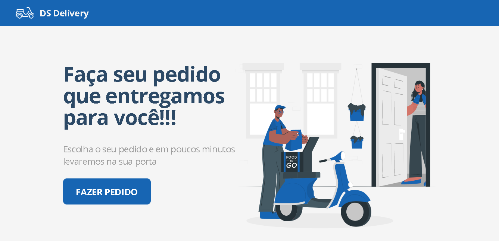
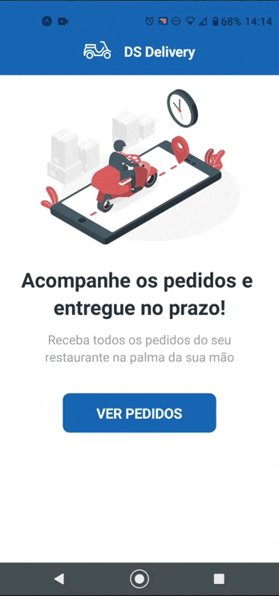

# **DSDelivery** [](https://img.shields.io/badge/build-passing-brightgreen?style=flat-square&logo=appveyor)



# Description
A delivery web app, built in Java for training purposes. Its backend architecture was written using the Spring tooling and the frontend was written in React JS in TypeScrypt. This small project gave me new experiences with react, many of them complex, because there was manipulation of maps and other complex things. The mobile was written in React Native with expo and TypeScript language. Access: [DsDlivery](https://dsdeliver-dacinho.netlify.app/). **Obs: the backend can be slow because it is obtained from the heroku app**

# Visuals
### WebApp
\


### Mobile App
\


# Installation/Usage

1. BackEnd:
   + Use the package manager [maven](https://maven.apache.org/) on your favorite IDE.
2. FrontEnd:
   + For React App use the package manager [npm](https://www.npmjs.com/) into 'front-web' directory: ```npm install```

# The End 😎...for a while
